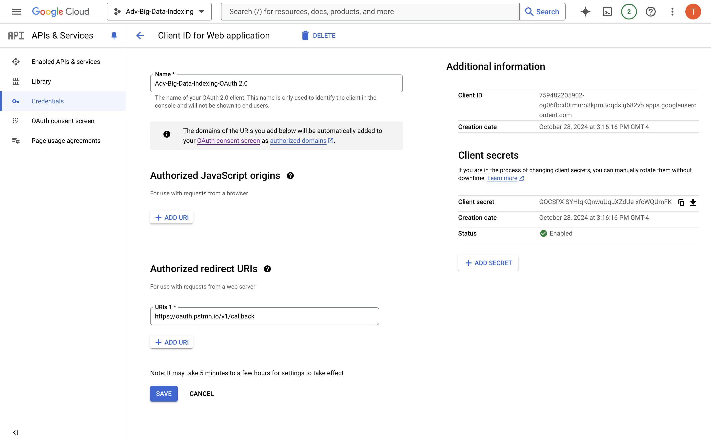
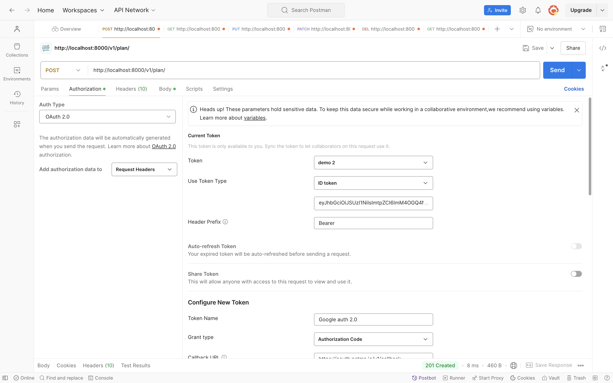

# Adv-Big-Data-Indexing---Medical-Plan-RESTful-App

This project provides a REST API to handle any structured data in JSON format.
 It supports Create, Read, Update and Delete operations (CRD), validates incoming data against a JSON schema, 
 and stores data in a key-value store. The API is designed with versioning, status codes, headers, and 
 validation mechanisms for a scalable and structured API architecture.

Features:
CRUD Operations: Supports POST, GET, PATCH, PUT, and DELETE operations.
Data Validation: Incoming JSON payloads are validated against a predefined schema.
Conditional Read and Write: Supports conditional read based on ETags and conditional write (update if not changed).
Key-Value Store: Data is stored in a key-value store for efficient retrieval.
REST API Semantics: Implements advanced REST API operations.
Versioning: API versioning through URI (/v1/).
Security: Implements Bearer token authentication using Google Identity Provider (IdP) and RS256 signing.

Method	URI	Description:
POST	/v1/plan - 	Creates a new entry in the store.
GET	/v1/plan/:id -	Retrieves a specific entry by ID, with conditional read support.
DELETE	/v1/plan/:id -	Deletes an entry by ID.
PATCH /v1/plan/:id-  Updates specific fields of an existing entry by ID in the key-value store. The request body must contain a JSON object with only the fields to be updated. This method supports conditional updates using the If-Match header. If the ETag does not match the current entry's ETag, a 412 Precondition Failed status will be returned.
P
 PATCH /v1/plan/:id  - Completely replaces an existing entry by ID in the key-value store. The request body must include a complete JSON object for the entry. This method also supports conditional updates using the If-Match header to prevent unintentional overwrites.

Status Code:
200	Success (GET, DELETE, PUT,PATCH)
201	Created (POST)
400	Bad Request (Invalid JSON or Schema)
404	Not Found (When the entry does not exist)
304 Not Modified if the data has not changed and the ETag matches
412 Precondition Failed if the ETag does not match
401 Unauthorized access
409 Conflict Plan with ID already exists

Headers:
Content-Type: application/json 
If-None-Match:  Used for conditional read with ETags.
ETag: Included in responses to represent the data version (used for conditional reads).
If-match: If the ETag does not match the current entry's ETag, a 412 Precondition Failed status will be returned.

JSON Data Model
This API accepts structured JSON data, validated against the following schema:

API Endpoints:
1. Create Data Entry (POST /v1/plan)
Creates a new data entry in the key-value store.

Request:
URI: /v1/plan
Method: POST
Body: Valid JSON that adheres to the schema.
Headers: Content-Type: application/json
Example Request Body

Response:
Status Code: 201 Created
Status Code: 401 Unauthorized If the request lacks valid authentication credentials.
Status Code: 409 Conflict - Plan with ID already exists
Body: A JSON object confirming the creation.
Headers: ETag header containing a unique hash of the created object for conditional reads.

2. Get data (GET /v1/plan/:id)
Fetches a data entry by its ID. Supports conditional read based on ETag values.

Request:
URI: /v1/plan/:id
Method: GET
Headers (Optional): If-None-Match: <etag>
Response:
Status Code: 200 OK if the data is fetched.
Status Code: 304 Not Modified if the data has not changed and the ETag matches.
Status Code: 404 Not Found if the entry does not exist.
Status Code: 401 Unauthorized If the request lacks valid authentication 

3. Delete data (DELETE /v1/plan/:id)
Deletes a specific entry from the key-value store by its ID. This method supports conditional deletes using the If-Match header. If the ETag does not match the current version of the resource, a 412 Precondition Failed status will be returned.

Request:
URI: /v1/plan/:id
Method: DELETE
Headers (Optional):
If-Match: <etag>
Response:
Status Code: 200 OK if the entry is successfully deleted.
Status Code: 412 Precondition Failed if the ETag does not match.
Status Code: 404 Not Found if the entry does not exist.
Status Code: 401 Unauthorized If the request lacks valid authentication 

4. Update Data (PATCH /v1/plan/:id)
   
 Updates specific fields of an existing entry by ID in the key-value store. The request body must contain a JSON object with only the fields to be updated. This method supports conditional updates using the If-Match header. If the ETag does not match the current entry's ETag, a 412 Precondition Failed status will be returned.

Request:

URI: /v1/plan/:id
Method: PATCH
Body: A JSON object with the fields to be updated.
Headers:
If-Match: <etag>
Response:

Status Code:
200 OK if the entry is successfully updated.
412 Precondition Failed if the ETag does not match.
Status Code: 401 Unauthorized If the request lacks valid authentication 

5. Replace Data Entry (PUT /v1/plan/:id)

 Completely replaces an existing entry by ID in the key-value store. The request body must include a complete JSON object for the entry. This method also supports conditional updates using the If-Match header to prevent unintentional overwrites.

Request:

URI: /v1/plan/:id
Method: PUT
Body: A valid JSON object that completely replaces the existing entry.
Headers:
If-Match: <etag>
Response:

Status Code:
200 OK if the entry is successfully replaced.
412 Precondition Failed if the ETag does not match.
Status Code: 401 Unauthorized If the request lacks valid authentication 

6. Get All data (GET /v1/plan)
Fetches a list of all plans stored in the system. It allows clients to access all available plan entries, enabling efficient retrieval of data.

Request:
URI: /v1/plan
Method: GET
Headers (Optional): If-None-Match: <etag> -  Used for conditional read support with ETags. If the current version of the resource matches the ETag provided, a 304 Not Modified response is returned instead of the full resource.

Response:
Status Code: 200 OK if the data is fetched.
Status Code: 304 Not Modified if the data has not changed and the ETag matches.
Status Code: 401 Unauthorized If the request lacks valid authentication 

## Headers
Content-Type: application/json

Indicates that the request body contains JSON data.

If-None-Match:
Used for conditional reads with ETags. This header allows the client to specify an ETag value. If the value matches the current ETag of the resource, the server responds with 304 Not Modified, indicating that the resource has not changed.

ETag:
Included in responses to represent the version of the data. Clients can use this value in subsequent requests with the If-Match or If-None-Match headers to ensure they are working with the most recent version of the data.

If-Match:
Used for conditional updates and deletes. This header allows the client to specify an ETag value for the resource. If the ETag matches the current version of the resource, the server processes the update or delete; if not, a 412 Precondition Failed status is returned to prevent unintended modifications.

# OAuth 2.0 Implementation:
Generating Access Token
To secure access to the APIs, OAuth 2.0 is implemented using Google Cloud Platform (GCP). Ensure you have valid credentials or tokens to access the API.
The following steps outline how to generate an access token using Postman:

Create Credentials in GCP:

Go to the Google Cloud Console.
Navigate to the APIs & Services > Credentials.
Click on Create credentials and select OAuth 2.0 Client IDs.
Configure the consent screen and select the application type(Web application ).
Authorized domains: oauth.pstmn.io
After creating, note down the Client ID and Client Secret.

### Screenshot

Postman Setup:

Open Postman and create a new request.
In the request type dropdown, select POST.

In the Authorization header, select the following accordingly in the images.
For example
Auth Type: OAuth 2.0
Add authorization data to: Request Headers

Use Token type: ID token
Header prefix: Bearer

client_id: Your Client ID from GCP.
client_secret: Your Client Secret from GCP.
grant_type: Authorization code
scope: openid

Then
Click Send to generate the access token.
Upon successful request, you will receive a JSON response containing the access token.

Access Token Expiry:
The generated access token will expire in 1 hour (3600 seconds). Token expiry is handled in the application by refreshing the token or generating a new one as needed.

### Screenshot

